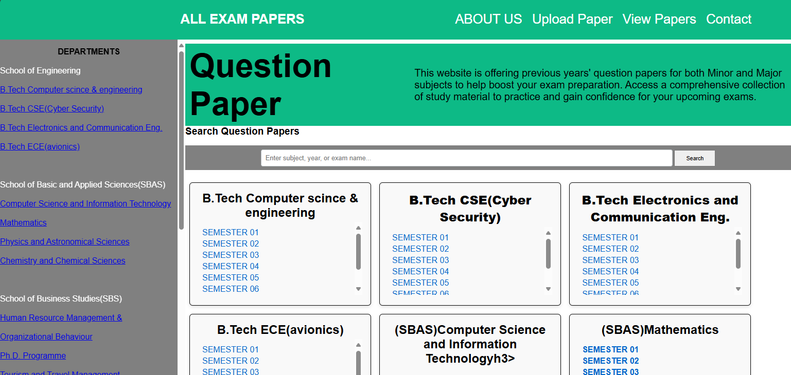

Click this to check the End result: https://mysticxsam.github.io/Portfolio-Website/

<h1>University Exam Paper Archive</h1>

This web application serves as a platform for students to easily browse, search, and download previous exam question papers across various subjects and semesters. Its user-friendly design enhances exam preparation by providing quick access to past papers.

<h2>Key Features</h2>
     <ul>
        <li><strong>Search Functionality:</strong> Quickly find exam papers by entering details such as subject, year, or exam name.</li>
        <li><strong>Latest Papers Section:</strong> A dedicated area to showcase recently uploaded question papers with download options.</li>
        <li><strong>Mobile-Friendly Layout:</strong> Fully responsive design ensures a seamless experience on any device.</li>
        <li><strong>Intuitive Navigation:</strong> Effortlessly navigate through sections like paper uploads, available papers, and contact support.</li>
     </ul>
</section>

